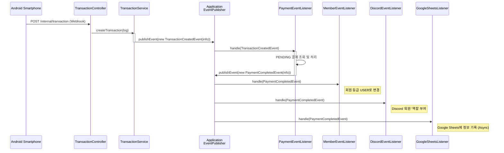

# [aegis-server](https://github.com/dkuaegis/aegis-server)

단국대학교 개발 · 보안 동아리 Aegis의 운영 자동화 및 회원 경험 향상을 위해 개발된 백엔드 서버입니다.  
동아리원의 가입 신청부터 회비 결제, 스터디 및 활동 참여, 포인트 시스템에 이르기까지 동아리 활동의 전반적인 라이프사이클을 관리하고 지원하는 것을 목표로 합니다.

# 주요 기능

- **회원 관리 및 인증**:  
  Google OAuth2/OIDC 기반의 안전한 소셜 로그인 및 회원가입을 지원하며, 동아리원의 역할에 따라 API 접근을 제어합니다.
- **독자적 결제 시스템**:  
  동아리 회비 결제 요청 생성 및 은행 입금 내역 자동 확인을 통해 결제 상태를 자동으로 갱신합니다. 또한, 관리자가 생성한 쿠폰을 발급하고 결제 시 할인을 적용하는 기능을 제공합니다.
- **포인트 시스템**:  
  스터디 출석, 활동 참여 등 다양한 동아리 활동에 대해 포인트를 자동으로 적립하며, 누적 획득 포인트를 기준으로 실시간 랭킹을 제공합니다.
- **스터디 관리**:
  스터디 개설, 커리큘럼 및 참여 조건 설정, 선착순 또는 지원서 기반의 두 가지 모집 방식을 지원합니다. 또한, 출석 코드 발급을 통한 참여자 출석 관리 기능을 포함합니다.
- **외부 서비스 연동**:  
  신규 회원이 회비를 납부하면 **Discord** 서버의 역할을 자동으로 부여하고, 주요 데이터(회원 명단, 포인트샵 당첨 내역 등)를 **Google Sheets**에 자동으로 기록하여 관리 효율을 높입니다.

# 기술 스택

- **Backend**: Java 21, Spring Boot 3, Spring Security (OAuth2/OIDC), Spring Data JPA
- **Database**: PostgreSQL, Redis
- **Testing**: JUnit 5, Mockito, AssertJ, Testcontainers
- **Documentation**: Springdoc
- **External Integrations**: Discord JDA, Google Sheets API v4
- **Build & DevOps**: Gradle, Docker, Coolify
- **Observability**: Spring Boot Actuator, Grafana Cloud
- **Backup**: Cloudflare R2

# 아키텍처

본 프로젝트는 복잡한 동아리 운영 요구사항을 안정적이고 유연하게 반영하기 위해 설계되었습니다.  
유지보수성, 테스트 용이성, 확장성에 중점을 두고 **클린 아키텍처(Clean Architecture)**, **도메인 주도 설계(Domain-Driven Design)**, **이벤트 기반 아키텍처(Event-Driven Architecture)** 를 핵심 철학으로 채택했습니다.

## 1. 계층형 아키텍처 (Layered Architecture)

프로젝트의 기본 구조는 전통적인 계층형 아키텍처를 따릅니다. 각 계층은 명확한 책임을 가지며, 의존성 규칙(상위 계층은 하위 계층에만 의존)을 엄격히 준수하여 계층 간의 결합을 최소화했습니다.

- **Controller (Presentation Layer)**: HTTP 요청의 엔드포인트 역할을 하며, 클라이언트의 입력을 DTO(Data Transfer Object) 형태로 받아 Service 계층에 전달합니다.
- **Service (Application Layer)**: 애플리케이션의 유스케이스를 구현하는 비즈니스 로직의 핵심 계층으로, 트랜잭션 관리의 경계가 됩니다.
- **Domain & Repository (Domain & Infrastructure Layer)**: 시스템의 핵심 비즈니스 규칙과 데이터 모델(Entity)이 위치하는 **Domain**과, 데이터 영속성을 처리하는 인터페이스인 **Repository**로 구성됩니다.

## 2. 도메인 주도 설계 (Domain-Driven Design)

복잡한 비즈니스 로직을 체계적으로 관리하기 위해 DDD의 **리치 도메인 모델(Rich Domain Model)** 을 적용했습니다. 이는 Entity가 단순히 데이터 필드와 Getter/Setter만 가지는 것이 아니라, 해당 데이터와 관련된 비즈니스 행위(메서드)를 직접 포함하는 설계 방식입니다.

### 설계 원칙과 이점

- **응집도 향상**:  
  `Payment`(결제)와 관련된 모든 로직(쿠폰 적용, 상태 변경 등)은 `Payment` Entity 내에 존재합니다.  
  이로 인해 관련 코드를 찾기 쉽고, 비즈니스 규칙의 변경이 필요할 때 해당 도메인 객체만 수정하면 되므로 유지보수가 용이해집니다.
- **캡슐화 강화**:  
  도메인 객체의 상태는 오직 그 객체의 메서드를 통해서만 변경될 수 있습니다. `Service` 계층에서 Entity의 상태를 직접 변경(`payment.setStatus(...)`)하는 것을 방지하여 데이터의 일관성과 무결성을 보장합니다.

### 예시: `PointAccount` Entity
포인트 계좌의 잔액을 변경하는 로직은 `Service`가 아닌 `PointAccount` Entity 자신이 책임집니다.  
`add()`, `deduct()` 메서드는 잔액 변경뿐만 아니라, 금액이 양수인지, 차감 시 잔액이 부족하지 않은지 등의 비즈니스 규칙까지 검증합니다.

```java
// aegis.server.domain.point/domain/PointAccount.java
public class PointAccount extends BaseEntity {
    // ...
    public void add(BigDecimal amount) {
        assertPositiveAmount(amount);
        this.balance = this.balance.add(amount);
        this.totalEarned = this.totalEarned.add(amount);
    }

    public void deduct(BigDecimal amount) {
        assertPositiveAmount(amount);
        if (this.balance.compareTo(amount) < 0) {
            throw new CustomException(ErrorCode.POINT_INSUFFICIENT_BALANCE);
        }
        this.balance = this.balance.subtract(amount);
    }
    // ...
}
```

## 3. 이벤트 기반 아키텍처 (Event-Driven Architecture)

서로 다른 도메인 간의 강한 결합(Coupling)은 시스템을 경직시키고 변경을 어렵게 만듭니다.  
이 문제를 해결하고 시스템의 유연성과 확장성을 극대화하기 위해 **Spring ApplicationEvent**를 활용한 2단계 이벤트 기반 아키텍처를 도입했습니다.

**흐름 예시: 회비 입금부터 결제 완료까지의 자동화 시나리오**

회원 회비 납부 과정은 외부 은행 시스템 연동부터 시작하여, 두 개의 핵심 이벤트를 통해 여러 도메인에 걸쳐 처리되며, 외부 API에 의존하며 오래 걸릴 수 있는 Google Sheets 적재는 비동기로 처리합니다.



### 1단계: 입금 발생 (`TransactionCreatedEvent`)

1. **Webhook 수신**: 안드로이드 스마트폰에서 구동 중인 은행 앱에서 입금 알림 수신 시, `TransactionController`의 Webhook 엔드포인트로 입금 내역 문자열을 전송합니다.
2. **트랜잭션 생성**: `TransactionService`는 수신한 문자열을 파싱하여 `Transaction` Entity를 생성하고 DB에 저장합니다.
3. **1차 이벤트 발행**: `TransactionService`는 입금 사실을 알리기 위해 `TransactionCreatedEvent`를 발행합니다.

   ```java
   // aegis.server.domain.payment.service.TransactionService.java
   public void createTransaction(String transactionLog) {
       Transaction transaction = transactionParser.parse(transactionLog);
       transactionRepository.save(transaction);
       if (isDeposit(transaction)) {
           // 입금 발생 이벤트 발행
           applicationEventPublisher.publishEvent(new TransactionCreatedEvent(TransactionInfo.from(transaction)));
       }
   }
   ```

### 2단계: 결제 처리 및 후속 작업 (`PaymentCompletedEvent`)

1. **결제 처리**: `PaymentEventListener`가 `TransactionCreatedEvent`를 구독하여 입금 정보를 확인합니다. 입금자명과 금액이 일치하는 `PENDING` 상태의 `Payment`를 찾아 결제를 완료 처리합니다.
2. **2차 이벤트 발행**: 결제가 성공적으로 완료되면, `PaymentEventListener`는 이 사실을 시스템의 다른 부분에 알리기 위해 `PaymentCompletedEvent`를 발행합니다.

   ```java
   // aegis.server.domain.payment.service.listener.PaymentEventListener.java
   @EventListener
   public void handleTransactionCreatedEvent(TransactionCreatedEvent event) {
       // ... 입금 정보와 일치하는 PENDING 상태의 결제(Payment) 조회 ...
       findPendingPayment(...).ifPresentOrElse(this::processPayment, ...);
   }

   private void processPayment(Payment payment) {
       payment.completePayment();
       paymentRepository.saveAndFlush(payment);
       // 결제 완료 이벤트 발행
       applicationEventPublisher.publishEvent(new PaymentCompletedEvent(PaymentInfo.from(payment)));
   }
   ```

### 3단계: 후속 작업 처리

`MemberEventListener`, `DiscordEventListener`, `GoogleSheetsListener`가 `PaymentCompletedEvent`를 각각 구독하여 회원 등급 상향, Discord 역할 부여, Google Sheets 기록 등 독립적인 후속 작업을 수행합니다.  
특히 외부 API 호출로 인해 지연이 발생할 수 있는 `GoogleSheetsListener`는 `@Async`를 통해 비동기로 처리하여 전체 트랜잭션 시간에 영향을 주지 않도록 설계되었습니다.

```java
// aegis.server.domain.member.service.listener.MemberEventListener.java
@EventListener
public void handlePaymentCompletedEvent(PaymentCompletedEvent event) {
    Member member = memberRepository.findById(event.paymentInfo().memberId()).orElseThrow(...);
    if (member.isGuest()) {
        member.promoteToUser(); // 회원을 GUEST에서 USER로 승격
    }
}

// aegis.server.domain.googlesheets.service.listener.GoogleSheetsListener.java
@Async("googleSheetsTaskExecutor") // 별도의 스레드 풀에서 비동기 실행
@EventListener
public void handlePaymentCompletedEvent(PaymentCompletedEvent event) {
    // ... Google Sheets API 호출 로직 ...
}
```

이러한 이벤트 기반 설계는 각 도메인의 책임을 명확히 분리하고, 시스템 전체의 유연성을 극대화하여 변화하는 요구사항에 빠르고 안정적으로 대응할 수 있는 기반을 마련합니다.
